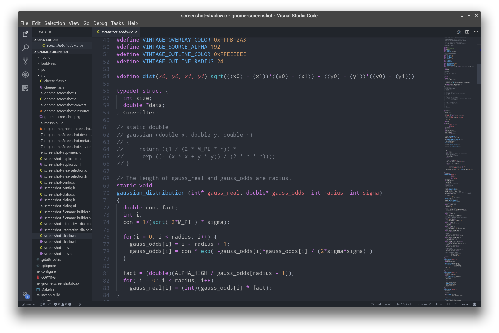

GNOME Screenshot Heavy Shadow
================
A GNOME Screenshot fork. Rewrited window shadow effect code with optimised algorithm and better effect.

GNOME Screenshot is a small utility that takes a screenshot of the whole
desktop; the currently focused window; or an area of the screen.

### Functional Updates
- Apr 23rd, 2018: 
    `src/screenshot-RGBA2RGB.c` newly added. With option `-t` in window shot, you can now save picture as transparent png (with alpha channel). Without option `-t` in window shot, you can save it as opaque jpg (with white background).

### Installation
- Arch Linux: `yaourt -S gnome-screenshot-heavy-shadow`, replace the original `gnome-screenshot`
- From source: `meson _build && cd _build && ninja && ninja install`
 Build dependencies: appstream-glib, meson, ninja, python

### Dependencies

 - GLib 2.36
 - GTK+ 3.0
 - libcanberra-gtk3
 - X11

GNOME 重阴影截图
================
基于原版 GNOME 截屏软件修改。窗口阴影重新设计了更好的算法，大大缩减计算量，同时相较原版效果更加美观。实际效果：

更多细节和截图可进入[我的网站](https://everdream.xyz/2017/10/gnome-screenshot-heavy-shadow/)查看。

### 功能性更新
- 2018 年 4 月 23 日：
    加入 `src/screenshot-RGBA2RGB.c`。在窗口截图时，带上 `-t` 选项将图片保存为透明 png（透明背景，alpha 通道），不带 `-t` 选项将图片保存为不透明 jpg（白色背景，无 alpha 通道）。

### 安装
- Arch Linux: `yaourt -S gnome-screenshot-heavy-shadow`，替换 `gnome-screenshot`
- 从源码安装：`meson _build && cd _build && ninja && ninja install`
 构建依赖：appstream-glib, meson, ninja, python

### 依赖
- GLib 2.36
- GTK+ 3.0
- libcanberra-gtk3
- X11
